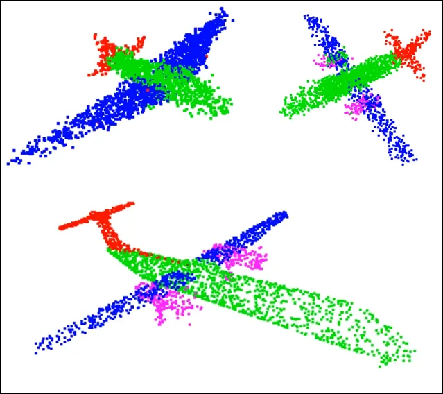
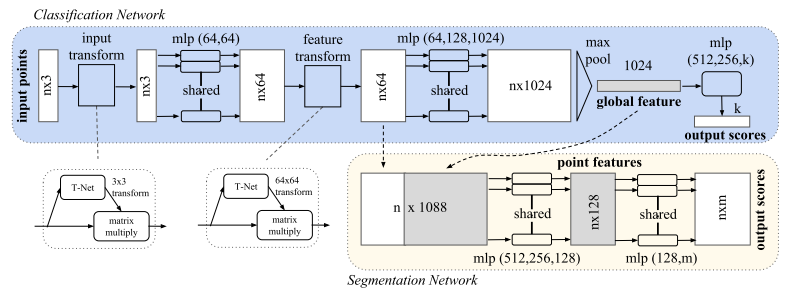
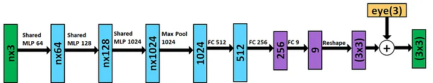
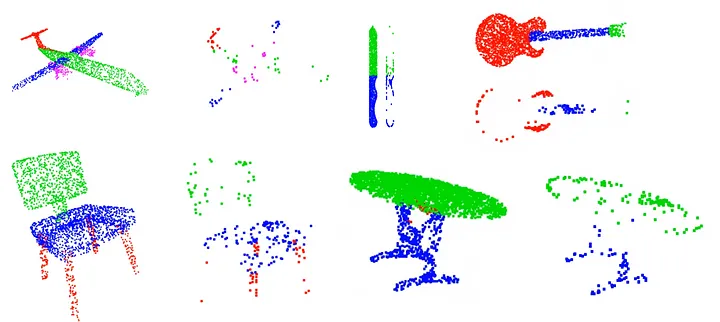

# PointNet: Deep Learning on Point Sets for 3D Classification and Segmentation

## Introduction

Point Net is a novel type of Neural Network that directly consumes entire `Point Clouds`. It can classify an input point cloud, perform Semantic Segmentation, and even Part Segmentation. The key to understanding how Point Net can be effective at multiple tasks is that it is able to extract both local and global features of a Point Cloud regardless of orientation. It then passes these features into separate heads for classification or segmentation tasks.

## Point Clouds

A point cloud is just a set of `(x, y, z)` points in 3D space. We could also consider things like intensity in the case of LiDAR. Point clouds don’t have any ordering, we can shuffle the (x,y,z) points all we want, but we will still have the exact same point cloud. Point Clouds are also invariant to rigid motions, i.e. The Point Cloud remains unchanged if we rotate and/or translate it. It still represents the same structure it has only changed in orientation and/or position. Neighboring points form meaningful structures (attributes), a major utility of Point Cloud Processing is that it captures these spatial structures and encodes them as features in lower dimensional space.

## Point Net Architecture

### T-Nets

The full Point Net Architecture is displayed in above and we see that there are two T-nets. A T-net is a special Neural Network that learns a transformation matrix that will rotate the input point cloud to a consistent orientation. This concept is a 3D analog of Spatial Transformer Networks. In the forward pass, the input point cloud is multiplied by the learned transformation matrix. This enables Point Net to learn in an end-to-end fashion on many different representations of point clouds. It learns to orient the input point clouds before it performs feature extraction. The first transformation is on the input point cloud, at this point no feature extraction has occurred yet. After the first transformation, the features are scaled up to 64 with a shared MLP, this is when the feature extraction actually starts. Then another transform is performed on the 64 dimensional features to obtain the Local Features.

The T-net is a mini Point Net that performs it’s own feature extraction with a shared MLP and Max Pooling function, it then uses Fully Connected layers to scale down the features into a transformation matrix, the architecture is shown in figure below. This matrix is initialized with the identity matrix and the output of the network is added to it, this ensures that the matrix will be Non-Singular. The architecture for the T-net is the same for both the input transform and the feature transform, with the only difference being the feature dimensions (3 for the input transform, 64 for the feature transform).

### Critical Point Set

The points locations obtained from the Max Pooling layer can be used to find the Critical Point Set of the original point cloud. The critical point set is just the skeleton of the original point cloud, it is the set of points that defines the shape. Some examples are shown belowusing data from the Shape Net Core data set, in this case we are using 1024 critical points.

We can see that each critical point set barely describes it’s respective original point cloud, yet the fact that they show a base representation indicates that Point Net indeed learns the fundamental attributes of each Point Cloud class.

### Classification and Segmentation Heads

The Global Features are input into the classification head which is just an MLP the outputs K classes. This architecture is similar to early CNNs such as Alex Net.

The Segmentation head is a bit more involved. It uses both Local and Global Features which provide a rich representation of the point cloud. The Global Features are repeated in order to concatenate them with the Local Features. These concatenated features are passed through a shared MLP to obtain N segmentation scores for M classes.

## References

- [PointNet: Deep Learning on Point Sets for 3D Classification and Segmentation](https://github.com/charlesq34/pointnet)

- [An Intuitive Introduction to Point Net](https://medium.com/@itberrios6/introduction-to-point-net-d23f43aa87d2)